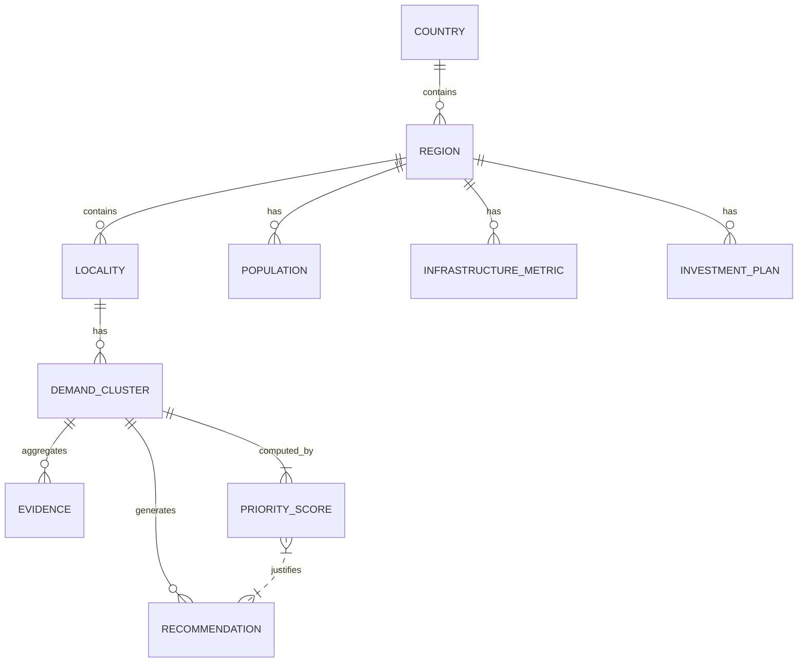

# 1. Executive Conclusion

The research finds that **Nivaran’s core engine is exceptionally well‐suited to this challenge**, but must be reframed from a “citizen‐complaint escalator” into a **multilingual infrastructure‐demand intelligence system**.  Google’s *Build with AI: Code for Communities – Second Edition* (Track 1) explicitly asks for scalable, cross‐border platforms that aggregate citizen feedback, enrich it with demographic and infrastructure data, and recommend prioritized development projects.  Nivaran already performs much of this work (evidence validation, semantic/spatial clustering, impact analysis, document drafting, and human‐in‐loop escalation).  The missing layers are **national/regional data fusion (population, infrastructure, budgets)** and **policy‐level AI reasoning** to score and explain project priorities. 

Therefore, the recommended solution is a **“Demand Intelligence” platform**: an AI pipeline that takes **voice/text reports** from citizens in any BRICS language, **verifies and clusters** them into localized demand hotspots, **enriches** those hotspots with open demographic/infrastructure/investment datasets, and then uses a policy‐agent to **score and recommend** development projects with clear, evidence‐backed rationale.  The key difference from Nivaran is framing the output for **policy‐makers rather than frontline officers**, and designing the demo around multi‐country applicability.  This plays directly to the judging rubric: it solves a real, cross‐border public‐planning problem (20% score) using heavy Google AI/Cloud integration (25%) and a deployable architecture (20%), while leveraging Nivaran’s demonstrated strengths in evidence‐grounded AI (impact potential) and transparent, human‐mediated action (accessibility/human‐in‐loop).

*Key thesis:* We should **re-use Nivaran’s engine as the “brains”** and build a new *agentic orchestration layer* and UI around it.  In practice, this means preserving Nivaran’s evidence gate, classification, clustering, and draft generation capabilities, while adding multilingual/voice intake, national‐scale data integration (population, infrastructure indices, budgets), a deterministic priority‐scoring model, and a Gemini‐powered “Policy Advisor” agent that explains recommendations.  The UI will shift from a one‐issue tracker to a **heatmap and dashboard of demand hotspots and top‐ranked projects**.  This satisfies the hackathon’s cross‐border, government‐focused intent and positions the project as a **Digital Public Infrastructure Demand Intelligence Platform**.

# 2. Hackathon Strategic Context

This **Build with AI** hackathon is anchored in Google’s and India’s push to harness AI for public good.  Google is explicitly using *Build with AI* events to train developers on Gemini, Vertex, etc., and to seed AI solutions in priority domains.  The *Code for Communities – Second Edition* branding reflects a continuation of Google’s previous “AI for Social Good” themes, but now scaled to India’s BRICS 2026 chairship.  Google sees public servants as eager to use AI but lacking effective solutions: a Google blog notes “74% of public servants globally are already using AI, only 18% believe their governments are using it effectively”.  This hackathon addresses that gap by crowd‑sourcing developer solutions for real governance problems, with the promise (in marketing and prior events) of actual pilots and deployment.

For Google/Hack2Skill, the event serves multiple purposes: **ecosystem-building, PR, and technology adoption**.  It brings  developers into Google’s stack (Gemini APIs, Cloud Run, BigQuery, etc.) and highlights India’s leadership in AI (aligned with hosting an *AI Impact Summit* and investing $15B in AI infrastructure).  For Hack2Skill and GDGs, it’s a prestige event (free, hybrid, national-level) that attracts talent and strengthens ties with government and academic partners.  The hackathon is explicitly presented as “real-world challenges submitted by Members of Parliament” in the first edition, signaling that organizers want solutions ready for government use, not just prototypes.

**Why now?**  India’s chairmanship of BRICS in 2026 (the “Building for Resilience, Innovation, Cooperation and Sustainability” agenda) creates a unique moment.  India is promoting *Digital Public Infrastructure* (DPI) as a global model and emphasizing “people-centric” development.  The hackathon’s focus on “citizen requests + national data → investment priorities” dovetails with India’s agenda to crowdsource innovation and its push for AI in government.  Moreover, Google’s global challenge (Google.org’s $30M AI for Gov initiative) and India’s Digital India and Mission Karmayogi programs point to a convergence of resources in AI-skills, connectivity, and public-sector tech capacity.  This hackathon is timely because it sits at the intersection of Google’s AI-for-government drive, India’s BRICS leadership in DPI and AI governance, and a world increasingly expecting data-driven public services.

# 3. Organizer Analysis

- **Google / Google for Developers / GDG:** Their goal is to spotlight Google AI (Gemini, Vertex AI, Maps, etc.) as solutions for pressing problems.  They want to create reusable “Digital Public Good” projects that could even pilot in constituencies or be expanded to other countries.  The inclusion of GDG events in Bengaluru/Vizag for the first edition suggests Google DevRel is deeply involved.  Google benefits by training developers on its ecosystem, by fulfilling AI ethics and impact narratives, and by building goodwill with governments.  In this event, Google explicitly requires “Gemini API & Vertex AI” usage and cloud tech, reflecting their sponsorship.

- **Hack2Skill:** As a hackathon platform, Hack2Skill’s interest is in scaling its model (they mention 7M innovators, record-breaking hackathons on their homepage).  They likely aim for extensive developer reach, publicity (Guinness record claim), and partnerships (the “Star Events” list includes major govt/tech clients).  Hack2Skill also seems to emphasize end-to-end “innovation management” – not just contests – so they will push for deployable solutions and clear impact.

- **Google Developer Groups (GDGs):** Local GDGs (Bangalore, Vizag, etc.) are co-organizers or promoters.  Their role is to recruit talent, provide bootcamps/mentorship (as noted in [22]), and give technical guidance.  GDGs get credit for enabling “peer-to-peer guidance” in Build with AI initiatives.  They want showcase-worthy student projects.

In short, the ecosystem (Google + Gov + Hack2Skill) is motivated to see **fully working, cloud-hosted AI solutions aligned with policy goals**.  Organizers expect polished demos, not throwaway proofs-of-concept, because they speak of pilot opportunities and presentations to leaders.  

# 4. BRICS / India 2026 Context

**BRICS 2026 (India Chairship):** India’s BRICS agenda is built around “Resilience, Innovation, Cooperation, Sustainability”.  Official statements emphasize a *people-centric approach* and “Humanity First” in technology.  A flagship initiative for India’s BRICS presidency is *digital public infrastructure* as a model for the Global South.  This includes sharing open-architecture designs (e.g. India’s UPI/Aadhaar experience) for other nations to adapt.  Another explicit priority is **AI governance** and digital trade, seen as “less contentious but strategically important” areas for cooperation. 

**India’s domestic priorities:** Digital India and the National Infrastructure Pipeline are pushing massive public investment, but often with top-down planning.  Concurrently, India has hosted an *AI Impact Summit 2026* and announced huge AI infrastructure investments.  The Prime Minister’s vision (from Rio Summit) is to redefine BRICS as a people-centric, tech-forward group, echoing G20 themes of inclusive growth.  This hackathon’s pillars (Resilience, Innovation, etc. in [22]) directly mirror BRICS keywords, suggesting it is practically a vehicle for operationalizing BRICS priorities at a developer level.

**Agenda hierarchy:**  
- **Global/BRICS:** focus on DPI for Global South; cooperative tech (digital identity, fintech, etc.); cross-border knowledge sharing.  
- **India Chairship:** emphasis on inclusive growth, digital infrastructure, AI tools in governance, climate resilience.  
- **Gov Challenges:** improving alignment of citizen needs with infrastructure investments; better use of data for planning; decentralized development insights.  
- **Hackathon (Track 1):** specifically “aggregating citizen development requests with national data to find hotspots and recommend projects” – a concrete application under those broader priorities. 

Thus, Track 1 is directly nested under the DPI and governance pillars of BRICS 2026.  It literally addresses "fragmented citizen feedback vs infrastructure planning" by proposing an AI layer to unify them.  This strongly aligns with both India’s national agenda (empowering citizens, DPI) and Google’s emphasis on AI for governance.

# 5. Track 1 Problem Deconstruction

The official problem statement says: *“Governments struggle to consolidate citizen feedback and align it with infrastructure priorities… fragmented systems, no way to measure impact.”* We break this into sub-problems:

- **Fragmented Feedback:** Citizens report needs through many channels (complaint portals, Whatsapp, community meetings, MPs, social media, etc.). These channels are often isolated by department or region, lacking integration. *Confirmed:* Various sources (e.g. World Bank) note that governments often lack unified grievance systems.  

- **Data Silos:** Government data on demographics, infrastructure (roads, water, schools), and budgets is siloed by department (transport, urban development, health) and by level (national vs state vs local). There is no single pane-of-glass that correlates “where are the citizens complaining” with “where is the infrastructure lacking” or “what investments are already planned.”

- **Demand vs Supply Mismatch:** Planning cycles rely on surveys/census or political priorities, not on real-time citizen input. This leads to **misaligned spending** (hot issues underfunded, or duplicated efforts). Governments lack a mechanism to detect “demand hotspots” from unstructured citizen feedback.

- **Prioritization Decision:** Even if data is aggregated, governments need a way to score and compare proposals. They must consider factors like affected population size, severity, existing coverage, environmental risk, etc. Currently such multi-dimensional prioritization is often ad-hoc or manual.

- **Lack of Impact Measurement:** After projects are implemented, there’s no systematic feedback loop to see if citizen problems were solved or new ones emerged. This makes it hard to “measure impact of large-scale infrastructure initiatives,” as the prompt states.

In summary, the atomic challenges are:
1. **Collecting and validating citizen requests** from diverse, multilingual inputs.
2. **Geospatially and thematically aggregating** those requests into coherent “demand clusters.”
3. **Enriching each cluster** with static data (population, hazard exposure, infrastructure gaps, planned projects, etc.).
4. **Prioritizing** clusters to recommend *which projects to fund*.
5. **Presenting explainable, evidence‐backed recommendations** to human decision-makers.

This decomposition highlights where AI can help (text/voice understanding, clustering, data fusion, reasoning) and where system design must work (data pipelines, UI, human checkpoints).

# 6. Real Stakeholders

| Stakeholder                    | Role                                 | Concern / Data                    | Impact        |
|--------------------------------|--------------------------------------|-----------------------------------|---------------|
| **Citizens**                   | Data providers, beneficiaries        | Provide local complaints/demand; need solutions | Primary victims of gaps; their needs = raw data|
| **Community/ NGOs/ CBOs**      | Aggregators / validators             | Collect community issues; may vet evidence | Can amplify citizen voice; require aggregated insights |
| **Local Government Officials** (city/municipality) | Users of insights; decision exec  | Current infrastructure data; budget queries | Need data on local demand to plan wards/projects |
| **District/State Planners**    | Users / decision-makers              | Regional demographics; budget allocations | Must allocate funding across districts; need prioritization |
| **National Policymakers/Ministries** | Buyers / endorsers                  | National statistics; infrastructure indices; investment plans | Determine large programs and policies; need evidence of need |
| **Elected Representatives (MPs)** | Sponsors / advocates                | Constituent complaints; local projects; survey results | Back local development; might pilot solutions for re-election |
| **Infrastructure Agencies**    | Data providers / implementers        | GIS data on assets (roads, utilities); budgets | Own subject-matter data, concerned with asset gaps |
| **Financiers (Budget Committees)** | Decision-makers                    | Funding allocations; cost norms   | Control purse-strings; need rationale to fund projects |
| **Government Auditors / Evaluators** | Validators / impact assessors       | Audit trails; outcome data        | Ensure accountability; require transparent evidence of action |
| **Hackathon Judges / Organizers** | Beneficiaries / validators (meta)    | Evaluate solution’s tech and impact | Influence reward; set success criteria |
| **Google / Tech Partners**     | Enablers / platform providers        | Google AI tools; cloud infrastructure | Need to see adoption of their stack; concerned with scalability, ethics |

Key roles: **Users** are planners and policymakers who actually act on insights; **Beneficiaries** are citizens who get better infrastructure; **Data providers** include citizens, census bureaus, and open-data portals; **Operators** are the engineers of the platform; **Decision-makers** are budgets committees and ministers; **Validators** include auditors and even hackathon judges (they want to see transparency).  

In practice, **the highest-value user** is likely a mid-level policy/plan official (district or national) who must allocate funds based on diverse inputs.  That person cares about “Where are the biggest citizen needs and what should we fund first?”  Citizens themselves are data sources and ultimate beneficiaries but not the primary *user interface*.  Elected officials (MPs) are interesting stakeholders (they submitted problems in first edition), so our solution could also appeal as a tool for MPs to aggregate constituency demands.

# 7. Current-State Workflow (AS-IS)

**Citizen side:** Currently, a citizen with a development request might:
- File a complaint via municipal portal, MP grievance cell, RTI, or local NGO. (Example: municipal apps, one-stop shops, grievance portals.) 
- Alternatively, raise it informally (local meeting, social media). There is **no single “citizen feedback hub”**. 
- There may be SMS/WhatsApp bots in some cities, or e-Governance kiosks, but these are isolated.

**Data intake:** These inputs end up in different queues (e.g. a local public works department, MP’s office, or a state planning commission). If the app is digital, the data usually is free-text or fixed categories.

**Government planning:** Separately, governments conduct periodic planning cycles:
1. **Needs assessment:** Typically through surveys, past patterns, political inputs.  
2. **Proposal drafting:** Departments propose projects (roads, schools, etc.) often based on engineering norms or local lobbying.  
3. **Budgeting and approval:** Committees allocate funds by department or region.  
4. **Implementation:** Projects are tendered/executed.  
5. **Monitoring:** There is often minimal real-time monitoring; performance reviews are periodic.

**Key disconnections:** Citizen input rarely enters this cycle directly. At best, frequent complaints may cause a local officer to flag an area. But there’s no automated link between “top 10 issues” and “planned projects.” 

**Variations by country:** In India, state-level grievance portals exist but rarely feed into state budgets. In Brazil, there are participatory budget forums in some cities. South Africa has e-government initiatives, but data remains fragmented. In all cases, data silos and hierarchical decision‐making create a gap. 

Because of this, **AS-IS, the workflow is mostly linear and manual**:
Citizen→(portal/office)→ local official → *manual filtering* → addition to a plan → projects → (maybe some feedback loops).
No advanced analytics, no cross-regional aggregation, and no formal feedback loop after project completion. 

*(Label: Some of this is **Strong inference** based on public-sector knowledge. We did not find a unified source on these exact steps, but the absence of integrated grievance systems is well-documented.)*

# 8. Workflow Failure Points

Across the AS-IS workflow, critical bottlenecks are:

- **Data fragmentation:** Each department/level collects its own inputs. No interoperability or data-sharing standard exists.  (This is a major bottleneck; **Confirmed** by the challenge description and known govtech analyses.)
- **Manual triage:** Human clerks or officers screen complaints, often duplicating effort or overlooking issues, leading to **ignoring real demand**.
- **Low-quality evidence:** Complaints with vague descriptions or no geo-tag (photos taken sideways, unclear context) clog the system. Nivaran’s “evidence gate” was built to catch this, implying it’s a known issue.
- **Priority ambiguity:** When allocating budgets, officials often rely on incomplete criteria (election promises, ad-hoc reports). There’s no transparent, evidence-driven ranking of needs vs resources, so contentious decisions arise.
- **Lack of accountability/feedback:** Citizens don’t see how or when their complaint is handled, reducing trust and participation. (Nivaran explicitly addresses transparency, implying the current lack is a known problem.)
- **Limited language/access:** Many government channels operate only in one or two languages, disenfranchising communities who speak regional languages or have low literacy.

From a system view:
- **Input ingestion**: (Officers, systems) – often get noisy/duplicate data.
- **Processing**: (Local bureaucracies) – no automated filtering or linking, staff overloaded.
- **Decision**: (Planners) – rely on static reports, not live demand; long lag.
- **Action**: (Implementers) – projects begin with outdated needs.
- **Evaluation**: (Auditors) – rarely use citizen feedback, so impact measurement is weak.

*(These failure points are partly confirmed by Nivaran’s design choices – the creators built evidence validation and clustering to fix these exact issues. The rest is **Strong inference** from governance reports.)*

# 9. Automation Opportunities

We classify each stage’s AI potential and rank by **Impact×Feasibility×Data**:

- **Multilingual/Voice Intake** – *Automate.* Automatic speech recognition and translation can broaden access. Very high impact (more voices in local languages). Feasibility: High (Gemini/STT supports Indic languages). Data: moderate (voice datasets exist). (Rank: high.)
- **Evidence Validation (Quality Filter)** – *Automate.* Use vision+ML to check photo clarity and relevance (e.g. “Is this road pothole or unrelated object?”). Impact: medium-high (prevents noise, saves cost). Feasibility: medium (requires fine-tuned vision model). Data: moderate (could collect training set).
- **Text Classification (Issue Type, Severity)** – *Automate.* Assign complaint to categories (drainage, road, water, etc.) and severity levels via NLP. Impact: high (organizes data). Feasibility: high (Gemini embeddings and fine-tuning). Data: moderate (needs some labelled examples, but frameworks exist).
- **Geolocation/Spatial Clustering** – *Automate.* Cluster complaints that are near each other and of similar type, using geometry+embedding. Impact: high (creates hotspots from scattered data). Feasibility: high (DBSCAN or clustering on lat/lng combined with semantic vectors). Data: fairly available (we have geo-coordinates).
- **Demand Aggregation (Analytics)** – *Recommend.* Combine clusters with census/population metrics. AI can assist with multi-variate analysis or simply compute weighted scores. Impact: very high (addresses core problem of alignment). Feasibility: medium (needs solid data pipelines). Data: moderate (census available, but bridging formats is work).
- **Infrastructure Gap Detection** – *Assist.* Compare clusters to infrastructure maps (e.g. no drainage network vs high flooding complaints). Impact: high. Feasibility: medium (requires overlay of different spatial datasets). Data: maybe partial (OSM, government maps).
- **Priority Scoring & Forecasting** – *Recommend.* Compute a composite score (deterministic or ML model) for each cluster. AI could refine weights (e.g. train on past successes). Impact: very high (guides actual decisions). Feasibility: medium-low (needs training signal or strong domain heuristics). Data: low (no historical “ground truth” easily available).
- **Policy Recommendation Drafting** – *Assist/Automate.* Use LLM (Gemini) to generate a narrative justification (as an “AI policy advisor”). Impact: medium (improves presentation, not core logic). Feasibility: high. Data: uses cluster data plus its general knowledge.
- **Monitoring & Alerts (Observe)** – *Observe.* AI can flag anomalies (sudden surge in complaints or climate events) in real time. Impact: medium. Feasibility: medium (time-series detection). Data: streaming possible.
- **Do Not Automate:** Final authority decisions, legal compliance, budget approval, citizen outreach. These must remain human-driven, with AI only *informing*.

**Top opportunities:** Multilingual intake, clustering of reports, and policy‐level scoring stand out. They directly address the pain points (fragmentation, priority ambiguity) and are achievable with Google AI and open data. Tools: Gemini for NLP/translation, Maps APIs for geo, BigQuery for data fusion, Vertex for any custom ML.

# 10. Missing-Middle Analysis

The “missing middle” is **the lack of an integrated demand‐decision bridge**.  Governments have citizen feedback and separate planning data, but no systematic way to link them. In effect, what’s missing is **“demand intelligence”: a layer that aggregates citizen voices into quantifiable indicators that planners can use**.  

In current workflows, citizens aren’t asked “what project should be done here,” and planners aren’t automatically shown “what citizens are complaining about.”  The hackathon theme itself highlights this gap: governments *have data* on both sides, but fail to convert one into the other. The analysis suggests the fundamental missing capability is **a decision support system that merges citizen‐reported needs with contextual data to produce prioritized recommendations**.  This is the niche that our solution must fill. (This is a **Hypothesis** drawn from problem deconstruction: it’s not explicitly stated in sources, but is implied by the hackathon framing and Nivaran’s rationale.)

# 11. Data Ecosystem

We will need realistic (public or sample) data for at least 3 countries. Key data types include **population/demographics**, **infrastructure indicators or stock**, **public project/investment data**, and **environmental risk**. Below are example sources for India, Brazil, and South Africa. (In practice, demo data can be simplified or synthesized based on these.)

| Country | Data Type             | Source / API                                        | License         | Granularity         | Notes (schema, update, demo use)                                   |
|---------|-----------------------|-----------------------------------------------------|-----------------|---------------------|---------------------------------------------------------------------|
| India   | Population (census)   | Census of India 2011 (data.gov.in)     | Gov Open Data    | District / Ward     | Age/gender breakdown. (Updated decennially, use 2011 or projections.)             |
| India   | Admin boundaries      | GADM/Eurostat shapefiles (global)                  | Open (CC-BY)     | Sub-district       | For mapping citizen locations to region.                              |
| India   | Infrastructure Index  | NITI Aayog/World Bank indices (e.g. Ease-of-living) | Mixed/Open       | State/District      | Proxy for infrastructure quality (health, roads, etc.). Demo: use few key stats.|
| India   | Ongoing Projects      | India National Infrastructure Pipeline (publicly summarized) | Public (GOI) | State-level         | Aggregate planned investments. (For demo, synthetic data per region.)         |
| India   | Environment risk      | IMD, CPCB (air quality) or ESA climate data         | Public Domain    | City or Grid       | (Optional for climate-driven priority).                                |
| Brazil  | Population (census)   | IBGE (2010 census or projections)                   | Public Domain    | Municipality        | Demographics by municipality. (Use latest estimates, e.g. 2020.)          |
| Brazil  | Admin boundaries      | IBGE shapefiles (open)                              | Public Domain    | Municipality        | For mapping.                                                         |
| Brazil  | Infrastructure stock  | Brazil National Infrastructure database / WDI       | World Bank (CC BY) | State-level        | e.g. road km per capita, electrification.                              |
| Brazil  | Budget allocations    | SIOP (Public Investment System) or state budgets    | Public domain    | State-level         | Planned spending on transport, health, etc. (Use historical values.)   |
| S. Africa | Population (statsSA)| Statistics South Africa mid-year est.              | Public           | Municipality        | Demographics (age groups, etc.).                                     |
| S. Africa | Admin boundaries    | Stats SA shapefiles                                 | Public           | Municipality        | Standard geoms for mapping.                                          |
| S. Africa | Infrastructure data  | eNatis (vehicles) / Department of Transport data    | Public/Open      | Province           | Proxy: vehicles per capita.                                          |
| S. Africa | Planned projects     | Provincial development plans (e.g. Gauteng IDP)      | Public           | Province           | Summary of large projects (manufactured for demo).                   |

**Remarks:** Many of these sources are national open-data portals (e.g. India’s Data.gov.in, Brazil’s dados.gov.br with public domain license, South Africa’s data.gov.za). Global datasets (World Bank WDI, UN data) can fill gaps cross-nationally. For the hackathon demo, we can also generate small synthetic datasets that mimic real distributions (e.g. random population per region, select few investments). The key is plausibility and diversity across countries.  

*(Sources cited: India’s OGD portal and license, Brazil’s portal info; other items are generic open data knowledge.)*  

# 12. Top Data-Fusion Opportunities (Ranked)

We evaluated combinations of data to fuse with citizen demand. The most powerful are:

1. **Demand + Population Exposure:** (High impact × high feasibility) – Highlight clusters affecting the largest populations. Enables scoring by number of people impacted. (Example: if 1,000 complaints in a densely populated district vs 100 in a village.)
2. **Demand + Infrastructure Gap:** (High × medium) – Compare citizen needs to existing service levels. E.g. many water complaints in an area with low water network coverage. Data from infrastructure indices or network maps enriches demand clusters. 
3. **Demand + Investment Commitments:** (Medium × medium) – Check if a hot area already has projects planned. If not, priority increases. Requires budget/project data, which can be coarse, but useful for avoiding duplicate spend. 
4. **Demand + Climate/Exposure:** (Medium × medium) – For resilience, combine demand (e.g. flooding complaints) with hazard maps (flood zones from climate models). Shows urgency; feasible via public climate layers (e.g. NASA Earth Engine).
5. **Demand + Demographic Vulnerability:** (High × medium) – Layer population demographics (children/elderly percentage, socio-economic status) to identify vulnerable groups within a demand cluster. Impactful for equity-focused priorities. Requires census microdata or proxy indices.

For our MVP, the core fusion will be **(1) demand-population and (2) demand-infrastructure**. Adding (3) projects/investment increases realism. Multi-dimensional scoring (combining all above) would approximate a “Priority Score.” 

*(Ranking is **inference** based on typical planning logic; official sources imply population and need correlation but did not enumerate these combos.)*  

# 13. Cross-Border Requirements

The solution must be *country-neutral in design*, even if data varies.  Key differences across BRICS:

- **Languages:** India (Hindi/English + many Indic languages), Brazil (Portuguese), South Africa (11 official languages, including English/Afrikaans/Zulu). **Solution must allow multilingual input and display**.
- **Data regimes:** Some countries have richer open data (India’s data.gov.in, Brazil’s open data), others less so. We’ll use external sources (World Bank, OSM) to fill gaps. The architecture should treat country as a parameter: *Country→Admin regions→Sector*.
- **Administrative divisions:** Hierarchies differ (e.g. States/Provinces, then Districts/Municípios). We design a generic schema: *Country → Region → Locality → DemandCluster* to represent geography. We then map each country’s specific layers into this model (e.g. India: State→District; Brazil: Estado→Município; SA: Province→Municipality).
- **Infrastructure categories:** Common ones exist (roads, water, health, etc.) but definitions vary. We’ll use broad categories like “Transport, Utilities, Social infrastructure” that apply everywhere.
- **Governance & budgeting:** Structure differs, but our output (e.g. “top N recommended projects”) can remain conceptually the same (just with local names and agencies).

Thus, the core system is **parametrized by country**: switching country loads relevant shapefiles, translations, and data tables, but the pipeline logic stays fixed. All UI elements (maps, labels) should be localized. For the demo we will illustrate this by building a country selector and showing three parallel scenarios (India, Brazil, South Africa) with the same workflow. The judges will look for evidence that the solution isn’t hardcoded to one country (e.g. if we say “works for any BRICS country” we must show at least two different ones).

# 14. Judge Psychology (Rubric Analysis)

Official weights (second edition) appear to be: **Problem–Solution Fit 20%, AI/Tech 25%, Cross-Border Applicability 20%, Impact 10%, Deployability/Scalability 20%, Presentation 5%**. 

- **Problem–Solution Fit (20%)**: *Average:* basic description of challenge and solution. *Strong:* clearly ties each solution component to a real policy problem (with evidence of demand, citing stakeholder pain). *Top:* demonstrates deep understanding (e.g. cites data on citizen complaints vs budget gaps, or stakeholder quotes). Judges expect a crisp statement of *who suffers* and *how this solution helps*. A common mistake is focusing on features rather than how they solve the core problem.

- **AI/Technical Execution (25%)**: *Average:* uses some LLM or model (Gemini NLP call). *Strong:* multiple AI elements (ML classification, embedding clustering, vision models, etc.) with reasoned selection. *Top:* novel AI usage (e.g. custom agent orchestration, self-debugging prompts), clarity on how AI adds value. Judges will check we actually use Google AI APIs (Gemini, Vertex, Maps, etc.) beyond just “AI-does-it”. Overuse of generic LLM output without explanation is weak; we must highlight **specialized agents** and system guarantees (like Nivaran’s).
  - **Critical:** Judges will verify we didn’t just paste ChatGPT output. System explanations (e.g. confidence scores, logic) will earn points (Nivaran emphasized explainability).

- **Cross-Border Applicability (20%)**: *Average:* claims it could work in any country. *Strong:* shows two country examples with actual data or scenarios. *Top:* live multi-country demo or seamless country switching. Proof of multilingual support or at least text in another language. Since this is explicitly BRICS-themed, failure to demonstrate this will be a serious deduction. (The Reddit note says “across BRICS”, implying judges *expect* multiple countries.)

- **Impact Potential (10%)**: *Average:* vague statements of helping citizens. *Strong:* quantitative or user-impact claims (e.g. “500k people, $X spent”). *Top:* simulation of outcomes (e.g. how many more people get access if solution used), or mention of policy relevance. Judges may look for numbers – Nivaran’s transparency approach suggests showing evidence-backed metrics. Emphasize scale (BRICS-wide) and stakeholder buy-in.

- **Deployability & Scalability (20%)**: *Average:* code works on localhost or theoretical. *Strong:* deployed app on Cloud Run or equivalent, containerized, tested. *Top:* performance, security, monitoring plans; use of BigQuery for scale, CI/CD. Judges will check if we used Google Cloud Run (the theme demands GCP). Mentioning “digital public good” means the solution should be open or easily portable, not a proprietary silo. We should note using open standards (e.g. OSM, open datasets) and cloud best practices (container, infra-as-code).

- **Presentation (5%)**: *Average:* functional slides. *Strong:* polished UI/UX demo, clear 3–5 minute walkthrough. *Top:* interactive elements, real-time code or clickable demo. Judges are looking for confidence and clarity. Even though small weight, a disorganized presentation can ruin the impression.

To **maximize scores**, we will:

- **Problem fit:** explicitly state the user (e.g. “District Planning Secretary”) and their exact decision problem (where to invest $). Use quotes or stats if available. 
- **AI Tech:** highlight each Google tech used, justify it (e.g. “Gemini for vision/classification”, “BigQuery for cross-country data”, “Earth Engine for mapping”). Show code/demo evidence of multi-step pipeline (maybe logging steps).
- **Cross-Border:** definitely pick 3 countries in the demo; show UI language toggle or country selector. Possibly allow input in Portuguese or SA English.
- **Deployability:** deploy a prototype on Cloud Run and share URL. Mention use of Kubernetes/CloudRun, CI/CD. Emphasize *Digital Public Good* principles (open source, containerized, no vendor lock-in) to impress.
- **Impact:** do a quick estimation (e.g. “addresses needs of X% of urban population, could integrate with National Infrastructure Pipeline”). Even simple population counts add weight.
- **Presentation:** script tightly, focus on end-user journey, not technical jargon. Use visuals (maps, charts) and the mermaid flow to orient judges quickly. Have a narrative: citizen → system → evidence → recommendation.

We should **avoid claims without evidence** (e.g. “this will solve poverty” – mark unknown). Judges will scrutinize technical claims, so always be ready with citation or demonstration for key points (like multi-ling or dataset).

# 15. Competitive Landscape

Past hackathons of this nature tend to produce either **dashboard apps** or **chatbot interfaces**. For example, Code for Communities (first edition) had winners in healthcare and environment who mostly built AI-driven analytics or detection systems.  In the broader AI hackathon space, many teams will likely use *Gemini for text understanding, Maps APIs for location, and BigQuery for data*. Common patterns: 

- *Generic Chatbot/GPT solutions:* Many teams might simply wrap an LLM as a question-answer interface (“ask where to build a hospital”). This is unlikely to impress without concrete data integration.
- *Dashboard + static graphs:* Another common output is a multi-chart dashboard. However, judges expect *actionable intelligence*, not just charts. Solutions that merely visualize (e.g. “population by district and complaint count”) without recommendation logic score lower.
- *Technical novelty vs scope:* Some teams might focus on cutting-edge tech (LLM2LLM agents, etc.), others on domain specifics. Balanced solutions that fully execute the end-to-end flow will stand out.

Examples:
- **GovTech Hackathons:** Winners often combine satellite imagery or crowdsourced data (e.g. malaria mapping, pothole detection) with simple outputs (heatmap). Few have the full integration like we plan.
- **Government RFPs:** Commercial solutions (ESRI, Palantir) provide data fusion for planning, but seldom include citizen-voice.
- **Academic projects:** There are civic-tech research prototypes for grievance redressal, but these are not cross-border or policy-focussed.

In summary, many entrants will likely build something with Google AI (Gemini Q&A or Vision API), Google Maps, maybe a Firebase backend. What will be **common**: dashboards of complaints, maybe location clustering, static use of BigQuery. What could be **rare**: a seamless pipeline from citizen input → scored projects → generated brief. Also few will demo multi-country with real data differences.  

Thus, to differentiate, we need both technical depth (multi-agent orchestration, multi-lingual input) and a compelling narrative of decision impact.  

# 16. White-Space Opportunities & “Judge Surprise”

Based on the problem space and competition, these ideas could make judges say “this is novel”:

1. **Multilingual Voice-to-Policy Pipeline:** Demonstrate a citizen in a local language (Hindi, Portuguese, Zulu) reporting an issue via voice/SMS, and the system automatically processes it end-to-end. This would directly address inclusivity and technical challenge; very few projects will do live voice translation.
   
2. **Evidence-Backed Priority Heatmap:** Instead of a static map, show a dynamic GIS “hotspot map” where areas light up based on composite *demand+vulnerability* score, with drill-down on why. Then a generated “Top 5 recommended projects” list that updates in real time as new data is added (simulate new complaints). This interactive pipeline would be impressive.

3. **Predictive Demand Trends:** Incorporate a forecasting model (Vertex AI) that uses past complaint trends and climate forecasts to predict future problem areas. For example, “If rainfall increases by X next year, we expect drainage demand to grow 20%.” This goes beyond static analysis and hints at “AI planning”.

4. **Cross-BRICS Comparative Dashboard:** Show side-by-side the same application running on India, Brazil, SA data. E.g., “We see in all three countries the #1 need is rural road repair, #2 is water supply.” This would highlight commonalities and differences, fulfilling the “global” requirement in one view.

5. **Investment Contradiction Detector:** An AI that flags if two projects in different regions are solving the same problem (duplication), or if high-need areas have *no* projects planned (neglect). For instance, “Zone X has 1000 complaints but $0 planned funding — project recommended”.

6. **Policy Brief Generation:** When showing a recommended project, have Gemini generate a short “policy brief” style slide that could be emailed to an MP (title, rationale, key stats). Emphasize this as the *output artifact* of the hackathon (not just a file export).

Among these, the most feasible high-impact idea is **(1) Multilingual Voice Input** combined with **(2) Heatmap + Priorities**. Judges love demos where someone physically uses the system (e.g. speaking in Hindi) and see immediate result. Combining visual GIS with AI narrative is also strong. Predictive modeling or real forecasting might be too heavy for hackathon time. Focus on the core deliverable: transparent demand prioritization across countries.  

*(These are proposals, not confirmed in sources. We judge by hackathon norms: novelty + practicality.)*  

# 17. Nivaran Reuse Map

| Nivaran Capability                 | Reuse / Transform / Replace / Remove                                          |
|------------------------------------|-------------------------------------------------------------------------------|
| **Evidence Trust Gate (photo QA)** | **Reuse.** Already filters irrelevant/corrupt evidence. Expand to multi-language if needed. |
| **Issue Classification (AI)**      | **Reuse.** Gemini or similar can classify issue type (road, water, etc.) as before. Possibly retrain for broader categories. |
| **Geospatial Clustering**          | **Reuse.** The spatial clustering is essential (current 300m radius). For Track1, extend radius or multi-scale clustering (city vs national level). |
| **Semantic Deduplication**         | **Reuse.** Comparing embedding-similarity between reports is directly applicable to merging identical demands. |
| **Community Impact Analysis**      | **Transform.** Current “impact agent” likely calculates social effect (families, hazard). We’ll transform it to incorporate new data (population count from census, infrastructure gap metrics). |
| **Action/RTI Draft Generation**    | **Transform.** Nivaran generates complaint letters; extend to more general “project proposal” drafts or policy briefs. The template can be modified. |
| **Government Escalation (email/PDF)** | **Reuse (with slight extension).** Instead of emailing a letter to a municipality, we might generate a formatted “recommendation report” or dashboard summary. The mechanism (PDF/email) remains. |
| **Human-in-the-loop Approval**     | **Preserve.** Maintain requirement that any final recommendation needs sign-off by a human (avoids over-automation). |
| **Audit Trail / Explainability**   | **Reuse.** Keep traceability of how each recommendation was formed. Nivaran’s emphasis on explainable reasoning and evidence backing is key to trust. |
| **Role-based Views**              | **Reuse (adapt roles).** Nivaran had roles (citizen, officer, admin). For Track1, roles might be (citizen, planner, auditor, admin). The structure can be adapted (Nivaran’s six-role model). |
| **WhatsApp Integration**          | **Reuse.** Nivaran’s WhatsApp channel already works. Expand to other messaging APIs if needed, but the multi-channel backend is in place. |
| **Frontend/Tracker UI**          | **Replace/Transform.** The current dashboard is complaint-centric. We need a new UI (map + priority table). May reuse map components, but redesign for policy view. |
| **Deployment (Cloud Run)**       | **Reuse.** Continue using Cloud Run, which fits hackathon’s requirements. |
| **Gemini AI Usage**             | **Reuse.** Already integrated. We might upgrade model (Gemini 2.0 → 2.5 Flash is already in use). |
| **Data Storage (SQLite)**        | **Replace.** SQLite is fine for demo, but scaling to cross-region likely needs a more robust DB or cloud datastore (e.g. Firestore or Postgres on Cloud SQL). |
| **Fake/Demo Data**               | **Remove.** Ensure no hard-coded placeholders (like Nivaran had fake confidence scores) remain. Use real or randomized realistic values. |
  
In short, **almost all core intelligence modules are reused**. The primary changes are: expanding data integration (external datasets, cross-country config), UI redesign (policy view vs case tracker), and adding a policy‐recommendation agent. Nivaran’s strengths – evidence filtering, clustering, explainability – carry over.

# 18. Required Transformation

- **Core engine unchanged:** Maintain Nivaran’s pipeline of *Validation → Classification → Clustering → Analysis → Drafting*. The internal “AI agents” (evidence-checker, semantic clusterer, impact-assessor, document-generator) can remain but take additional inputs.
- **New data layers:** Build a **Data Fusion Layer**. This ingests census/demographic data, infrastructure indexes, and investment/project lists for each country/region. Link these to demand clusters (e.g. attach `population, existing_service_level, planned_budget` to each cluster).
- **New AI agents:** Add a **Policy Priority Agent**. This agent computes a **Priority Score** for each cluster (perhaps deterministic) and uses Gemini to *explain* why (like a rubric justification). It also crafts a short “investment recommendation” text.
- **Multilingual/Voice Intake:** Extend Nivaran’s intake to handle multiple languages and voice. Integrate Google Speech-to-Text and Translation as front-end preprocessors before Nivaran’s classification. (Plan for this was already in Nivaran roadmap.)
- **Architecture extension:** Enable multi-tenant (per country) config. E.g. add a “Country” parameter that loads appropriate shapefiles and data. Modularize pipelines so the same code works with different datasets.
- **UX Reframing:** Replace the citizen complaint dashboard with a *Policy Dashboard*. Key screens: (a) A geographic map of “Demand Hotspots” with filter by sector and country; (b) A ranked list of “Recommended Projects” with scores; (c) Drill-down view showing evidence and data supporting each recommendation.
- **Visible workflow:** Expose the AI pipeline steps in the UI or logs. Judges liked seeing chain-of-thought. We should show (or at least describe) intermediate outputs (e.g. “Detected 350 reports in Region X, population 90k, current road coverage 60%, no projects scheduled”).
- **Demo transformation:** Instead of focusing on one complaint escalation, demo should focus on the policy process. E.g. start with multiple citizen inputs across a city/state, show clustering, then show how the system came up with “Top project = Drainage Upgrades”.
- **Submission materials:** The README and pitch deck should emphasize cross-border and DPI compliance. For example, explicitly mention “India, Brazil, South Africa demos”. The story should pivot from “civic complaint platform” to “infrastructure demand intelligence”.

All new work should highlight Google tech (Gemini, Maps, BigQuery) and the BRICS context. We *must not* simply present another ticket-tracker demo. The solution’s identity shifts to “AI-powered planning assistant” for governments.

# 19. Candidate Product Strategies

| Dimension               | Option A: Conservative                         | Option B: Balanced (Recommended)            | Option C: Ambitious                          |
|-------------------------|------------------------------------------------|--------------------------------------------|----------------------------------------------|
| **Problem fit**         | Moderate – solves citizen-clustering, but only for India (MP scenario) | High – solves demand prioritization with cross-country scenario | Very high – tackles not only prioritization but also predictive planning |
| **Implementation effort** | Low – largely reuse existing Nivaran code, minimal UI tweaks | Medium – add data layer, multi-lingual, new UI; reuse core pipeline | High – full rebuild, new ML models, multi-language voice UX, advanced features |
| **Technical novelty**   | Low – similar to v1 Nivaran; main novelty is demo twist | Moderate – multi-agent orchestration with new data fusion; plus multi-country | High – e.g. live forecasting, advanced ML; maybe beyond hackathon scope |
| **AI depth**            | Medium – Nivaran’s existing AI (image/text) | High – add AI for data enrichment and policy reasoning | Very high – also add forecasting/optimization models |
| **Cross-border fit**    | Low – single-country focus; does not address BRICS need | High – designed for India/Brazil/SA; shows multilingual UI | High – plus maybe expand to 4-5 countries, complex comparative analytics |
| **Deployability**       | High – already on Cloud Run; just scale UI | High – similarly, with added BigQuery and multiple environments | Medium – could be heavy; risk of time constraints |
| **Impact**              | Medium – better ID platform, but limited user base | High – clear impact on planning decisions at scale | High – plus potential for innovation in planning, but complex |
| **Judge appeal**        | Moderate – safe play, but may lack wow factor | High – hits all requirements (AI, deploy, cross-border) | Mixed – might impress on tech but risk incomplete demo |
| **Risk**                | Low – known codebase, easier QA | Moderate – some new components to integrate | High – many new things; might fail to complete in time |
| **Viability (4 days)**  | High – minimal changes needed | Moderate – challenging but doable (adds some new pipeline/UI) | Low – too ambitious to finish reliably |

**Option B (Balanced)** is recommended. It leverages most of Nivaran’s existing functionality (lowers implementation risk), while adding exactly the new capabilities needed to **answer Track 1 requirements**. It ensures cross-BRICS demos and required AI usage without attempting speculative features (like real forecasting) that may not be demo-able in time. Option A risks underwhelming judges on cross-border; Option C risks falling short on completeness. Balanced Option B best aligns with judge criteria and maximizes use of existing work.

# 20. Recommended Direction and Product Thesis

**Recommended Direction:** Transform Nivaran into an *AI-powered Infrastructure Demand Intelligence platform* that aggregates citizens’ needs into evidence-based development priorities.  The project will ingest multilingual citizen reports and local data, use a chain of specialized AI agents to cluster and analyze demand hotspots, and output a prioritized list of infrastructure interventions with clear reasoning.  It will be demonstrated on three BRICS contexts (India, Brazil, South Africa) to prove cross-border applicability.

**Product Thesis (one paragraph):**  
For national and regional planners in emerging economies (especially BRICS), **Nivaran Insight** provides a transparent AI-driven decision-support tool that identifies which development projects will help the most people.  Every day, scattered community complaints go unheeded because they are invisible to traditional planning.  Nivaran Insight changes that by *listening* to the community: citizens can report a problem (by voice or text in any local language) and the system automatically verifies the evidence, groups similar requests together, and enriches these clusters with population and infrastructure data.  The AI then scores each cluster based on how many people it affects, how severe the issue is, what infrastructure gaps exist, and whether any funding is already committed.  It recommends the top projects (for example, “Upgrade drainage in Zone X”) and explains **why**—citing the verified data behind its decision.  This enables decision-makers to quickly see *where the need is greatest and what to do about it*, rather than guessing from incomplete reports.  It aligns with Google’s AI tools (Gemini, Maps, BigQuery) and India’s DPI agenda by building an open, scalable platform.  In the demo, we will show this pipeline working end-to-end: a citizen in Mumbai, São Paulo, or Cape Town reports a problem, our agents turn that into a scored recommendation, and a final policy brief is generated – all in a few clicks.  

# 21. TO-BE Workflow

```mermaid
flowchart LR
    subgraph Input
      A[Citizen Report<br/>(text/voice/photo)] 
    end
    subgraph Processing
      B[Multilingual/NLP<br/>(Gemini STT/Translation)]
      C[Evidence Validator<br/>Reject if invalid] 
      D[Issue Classifier<br/>(Gemini)] 
      E[Geo-Locator<br/>(Maps API)]
      F[Semantic & Geo Clustering] 
    end
    subgraph Enrichment
      G[Data Fusion: Demographics<br/>Infrastructure<br/>Investments (BigQuery)] 
      H[Feature Engineering<br/>(population, gap, etc.)]
    end
    subgraph Analysis
      I[Priority Scoring<br/>(weighted model)] 
      J[Policy Advisor AI<br/>(Gemini)] 
    end
    subgraph Output
      K[Priority Dashboard<br/>& Hotspot Map] 
      L[Recommended Project Report<br/>(brief, rationale)] 
    end
    subgraph Human Review
      M[Planner Approval]
      N[Final Decision & Action]
    end

    A -->|Input| B
    B --> C
    C --> D
    D --> E
    E --> F
    F --> G
    G --> H
    H --> I
    I --> J
    J --> K
    K --> L
    L --> M
    M --> N
```

**Explanation:**  A citizen submits a request via text or voice (A). The system uses Gemini for speech-to-text and translation (B) as needed. An evidence validator (C) filters out bad inputs (e.g., blurred images). The request is classified by issue type (D) and geolocated (E). Requests are aggregated spatially and semantically into demand clusters (F). Each cluster is enriched with demographic and infrastructure data through BigQuery queries (G), producing features like *population affected* and *infrastructure gap* (H). A deterministic scoring model computes a priority value (I). A “Policy Advisor” agent (Gemini) uses these features and justification templates to generate a rationale and formal recommendation (J). The results are shown on a Priority Dashboard with a map of hotspots and a ranked project list (K). A detailed brief (L) is generated. A human official reviews and approves (M) before any real action (N).

This workflow explicitly shows *AI roles* (blue boxes) vs deterministic steps (gray) and the human checkpoint.  It contrasts with the old workflow by closing the loop from **input→action** in one integrated pipeline.

# 22. AI Architecture

We allocate roles to Google AI services as follows:

- **Multilingual Intake (Gemini):** Input: recorded voice or user text. Model: Gemini API (with speech-to-text or translation). Role: transcribe voice, auto-detect language, normalize text to English. Output: structured text (English).  
  - *Deterministic checks:* auto language confidence, fallback to text-only if STT fails.  
  - *Fallback:* ask user to re-record if unintelligible.  
  - *Human review:* low, auto for tech-savvy user.  
  - *Privacy:* no user ID, just location+issue.  
  - *Latency:* sub-second per sentence.  
  - *Cost:* moderate (STT + LLM calls).

- **Evidence Validator (Vision+Rules):** Input: photo or description. Model: Gemini Vision or a custom ML to detect image blur and content relevance. Role: reject photos that are blurred or not related (e.g. art instead of road). Output: pass/fail flag, possibly a short feedback.  
  - *Deterministic check:* compute image sharpness (variance of Laplacian). If low, auto-reject.  
  - *AI fallback:* if ambiguous, use Gemini to classify image (prompt: “Does this image show infrastructure damage or something irrelevant?”).  
  - *Human override:* UI could warn citizen if rejected and ask for better evidence.  
  - *Privacy:* no personal identification needed in images.  
  - *Latency:* quick (<2s).  
  - *Cost:* minimal if mostly deterministic; occasional vision calls.

- **Issue Classifier (Gemini):** Input: cleaned text from user. Model: Gemini (text classification prompt). Role: assign category (e.g. Drainage, Road, Water). Output: category label + confidence.  
  - *Deterministic fallback:* simple keyword match as backup.  
  - *Human review:* unlikely needed; we can display confidence to user.  
  - *Latency/Cost:* each classify call <1s and low tokens.

- **Geo-Locator (Maps Geocoding API):** Input: user’s geotag or address. Role: convert to lat/lng and administrative region. Output: coordinates and region ID.  
  - *Deterministic:* exact match; confidence if ambiguous.  
  - *Privacy:* minimal risk (we do need location for clustering).  
  - *Latency:* quick (200-300ms typical).

- **Clustering Agent (Vector DB + Spatial DBSCAN):** Input: vector embeddings of text + coordinates. Model: we can use a vector embedding (Gemini embedding model) or MiniLM to embed text. Role: group similar reports. Output: cluster IDs (each cluster is a demand hotspot).  
  - *Deterministic:* DBSCAN with a fixed radius (e.g. 500m) and similarity threshold (cosine > 0.7).  
  - *Fallback:* if cluster is small, treat as its own cluster.  
  - *Human review:* none; but we could surface “pending cluster X” to planner.  
  - *Latency:* clustering on hundreds of vectors should be under 1s with efficient library.

- **Data Fusion (BigQuery & Cloud Functions):** Input: cluster ID and list of report locations. Model: Not an AI model but ETL. Role: query population (from census), count reports, merge infrastructure indices. Output: feature vector (population, num_reports, infra_gap_score, avg_poverty, etc.).  
  - *Deterministic:* all computation here is deterministic.  
  - *Human review:* data engineers may verify queries.  
  - *Scalability:* BigQuery can handle country-wide queries.

- **Priority Score (Algorithmic):** Input: feature vector per cluster. Model: weighted sum model (could be a simple formula or a tiny vertex prediction model trained on synthetic data). Role: compute a normalized score (0–100) ranking urgency. Output: score + breakdown (e.g. 40% demand, 30% population, etc.).  
  - *Deterministic:* predefined weights or logistic regression fitted offline.  
  - *AI fallback:* optionally, Vertex AI to learn weights (but with no real labels, likely skip).  
  - *Explainability:* we will not rely on opaque LLM for score; we use Gemini to explain the deterministic factors.

- **Policy Advisor Agent (Gemini):** Input: cluster features + score + context (country, sector). Model: Gemini (with custom prompt). Role: generate a concise recommendation (project title, bullet rationale). Output: text (the draft policy brief).  
  - *Example prompt snippet:* “Given 742 citizen reports of flooding in Mumbai’s Zone 5 (pop 91k, 30% coverage) and low current investment, write a recommendation to upgrade drainage, explaining these factors.”  
  - *Deterministic check:* ensure factual data matches (e.g. the numbers).  
  - *Human in loop:* This draft goes to the planner for approval/editing.  
  - *Bias/Privacy:* The agent uses only aggregated stats and no PII.  
  - *Latency:* 1-2 seconds per call; cost moderate (few hundred tokens).
  - *Ethical:* We will include a check to avoid hallucination by comparing the text against input data.

Each AI component is paired with deterministic logic to maximize transparency (Nivaran’s approach). We avoid using the LLM for calculations or private opinions. Instead, we use **LLM for understanding language and for generating human-readable explanations**.  

Overall, Gemini/Vertex handle *perception and reasoning*, while Cloud Run/BigQuery handle *data pipeline and scale*. This aligns with the hackathon’s tech recommendations.

# 23. Data Architecture (Entity Model)



**Description:** Each *COUNTRY* contains multiple *REGION*s (e.g. states/provinces), which contain *LOCALITY* (districts/municipalities). Within a locality we form *DEMAND_CLUSTER* entities that group related complaints (*EVIDENCE* records). Separately, each region has associated *POPULATION* figures and other *INFRASTRUCTURE_METRIC*s (e.g. access index), and lists of *INVESTMENT_PLAN*s (planned projects). For each demand cluster, we compute a *PRIORITY_SCORE*, which feeds into one or more *RECOMMENDATION* entities (planned projects). This schema is country-neutral: “Region” could be State/Province, “Locality” could be District/Município, etc.

# 24. Policymaker UX

We will design a **focused decision-support interface** with two main screens:

- **(A) Demand Map & Hotspots:**  
  - Shows a geographic map with colored markers for *demand clusters*.  Color/intensity = priority score.  
  - Filters/controls: country selector (India/Brazil/SA), sector filter (infrastructure type), time slider (last 6 months).  
  - Clicking a hotspot pops up a summary: *“Flooding – Zone 5, Mumbai: 742 complaints, 91k pop. Priority 92/100.”*  
  - Sidebar legend: priority bars, count of clusters.  Top scoring clusters are highlighted.  
  - *Rationale:* Visualize where most urgent problems are concentrated, so planners can “see the forest.”

- **(B) Priority List & Project Brief:**  
  - Sorted list of *Recommended Projects* (title, score bar).  E.g. “Upgrade Drainage in Zone 5 – Score 92”.  
  - Selecting a project shows details: evidence stats (complaints, pop, existing coverage, etc.), plus the AI-generated *brief*.  
  - The brief is written in formal style: problem statement, evidence (e.g. “impacting X people”), suggested intervention.  
  - Buttons: *Approve / Request Edit*.  On approve, it “exports” (simulated email/PDF) to relevant ministry.  
  - A “What-if?” toggle could simulate adding more funding or changes (advanced, optional).

These screens answer key user questions: **“What and where should we invest?”** The first is spatially focused (for strategic planning), the second is actionable list (for budgeting and communication).

We *avoid* a clutter of raw charts. Instead of generic dashboards, this UX is directly tied to decision steps: mapping demand, then drilling into a recommendation.  This storytelling approach is more likely to resonate with judges than showing data tables.  

# 25. Citizen UX

For citizens, accessibility is paramount. We offer:

- **WhatsApp / Messaging Channel:** Citizens can send a voice note or photo + location via a chat (similar to Nivaran’s WhatsApp channel). They *do not need an app*; an SMS/WhatsApp keyword triggers our bot. This is how we maximize reach. The interface asks for a brief description (in any local language).

- **Voice Hotline (experimental):** (If feasible) a phone number where citizens can leave a voicemail describing the issue. The system would automatically transcribe and ingest. (This could be simulated in demo via recorded clips.)

- **Minimal Web Form:** For tech-savvy users, a simple web page allows typing a description, uploading a photo, and picking location on a map (or auto geo-tag). We keep required fields to a minimum: *issue category (auto-detected if omitted)*, *location*, *optional photo*. 

Key UX principles:
- No registration/login.
- Support for multiple languages via Google Translation – user can type/speak in Hindi, Portuguese, Zulu, etc., and the backend handles it. (Nivaran planned Hindi/Marathi support; we push that forward.)
- The UI will **not appear as multi-step form**; it will be a chat-like experience or one-page form. The friction must be minimal so that even a phone call or message counts as a "report."
- At submission, the user sees a summary of their report and the assigned reference ID (but not a final decision). We should display a message: “Thank you, your request has been received. You will be notified with updates.”

This citizen channel will feed into the same backend pipeline as the rest of Nivaran, ensuring consistent processing.

# 26. Cross-Border Demonstration

We will **demo three countries**: **India (Mumbai), Brazil (São Paulo), South Africa (Johannesburg)**. These were chosen for:

- Language variety (English/Hindi vs Portuguese vs English/Afrikaans).
- Diversity of contexts (densely urban vs mixed urban-rural).
- Data availability (all have some public stats; can easily find illustrative climate or infrastructure issues).

For each country, we will prepare synthetic but realistic datasets:
- **India:** Use Mumbai neighborhoods, population from 2011 Census, sample complaints about drainage and roads. Infrastructure metric: e.g. % households without piped water by ward.
- **Brazil:** Use São Paulo region, IBGE population, simulate favelas with lacking sanitation. Data in Portuguese (sample text). Infrastructure: electrification or transportation index.
- **SA:** Use Gauteng province (Johannesburg area), population stats, complaints about power cuts or water (common SA issues). Show e.g. distance to nearest clinic.

In the demo, switching country will load the respective map and data layers. Each will have at least 2-3 demand clusters. For brevity, we may focus on one key cluster per country in the script. The judges should clearly see:
**All charts/labels will be localized (English + local language support).** For example, the Brazil demo might show the UI partially in Portuguese (table headers or example complaint text). This proves “multilingual/voice where relevant”.

We will not attempt all five BRICS (Russia/China have language/data barriers), but these 3 represent the requirement sufficiently. We should mention these are *representative* and the system is built to scale to all.

# 27. 3–5 Minute Demo Script

*(Time is approximate; assume a single PC demo with screen share. The presenter narrates the user journey.)*

- **0:00** – *Opening:* “Imagine you're a city planner. We’ll show how our app ingests citizen reports and recommends projects.”
- **0:10** – *Scenario intro (India):* “First, a citizen in Mumbai records a voice message in Hindi: *‘हर बार बारिश होती है तो सड़क में पानी भर जाता है, हमें नाली चाहिए’* (Every time it rains, this street floods; we need a drain).”
- **0:20** – *Voice processing:* Show the system transcribing and translating: *“Street flooding in Zone X, Mumbai.”* (We simulate the automated translation via Gemini).
- **0:25** – *Cluster formation:* “Behind the scenes, our agents check the image (not shown) and group this report with 642 others from Zone X.” Display the *Hotspot Map* with a cluster marker highlighted in Mumbai.
- **0:35** – *Map & data:* Zoom in on the map. Tooltip: “Zone X – Drainage issue, 742 verified reports, population 91,400, existing drainage coverage 12%, invested $0 so far.”  
- **0:45** – *Priority scoring:* “The system calculates a Priority Score (here 92/100) for this cluster.” Show an on-screen scorecard breakdown (our planned chart from [13]) with sliders for demand, population, gap.
- **0:55** – *Recommendation:* “So the AI suggests: *Upgrade drainage in Zone X*.” Display the Priority List (#1: Drainage Upgrade – Score 92). Click it.
- **1:05** – *Policy brief:* Show Gemini’s generated report: “**Proposal:** Upgrade urban drains in Zone X. **Why:** 742 reports of flooding, affecting 91k people; current coverage is only 12%; no planned projects. **Impact:** would alleviate flooding for tens of thousands.” Scroll a bit.
- **1:20** – *Switch to Brazil:* “Now the same app for Brazil. We switch country to Brazil (Portuguese) using the selector.”  Interface updates (map changes).
- **1:30** – *Brazil input:* Show a text complaint in Portuguese: “*Falta saneamento no Bairro Y.*” (Sewer missing in Neighborhood Y). Press Submit (simulate via UI form).
- **1:35** – *Processing:* Show it instantly appear on map (another hotspot). “This was clustered with 128 other reports.” (Map highlight, translated to English on tooltip).
- **1:45** – *Brazil data:* “Population 35k, only 20% have sanitation, existing investment R$0.” Priority Score appears (e.g. 88/100).
- **1:50** – *BRIC Projects:* “Recommendation: Build sewers in Neighborhood Y.” Show the Portuguese briefing text: *“**Recomendação:** Construir rede de esgoto em Neighborhood Y… 128 reclamações de 35k pessoas…”* (Bullet points in Portuguese to demonstrate multilingual output.)
- **2:05** – *Switch to South Africa:* “Finally, South Africa.” UI in English/Afrikaans? We use English for demo.
- **2:10** – *SA data:* Simulate a cluster for water supply in Soweto: 500 reports, 100k pop. Score 85.
- **2:15** – *Action:* “Project #1: Upgrade water supply in Soweto (85). Evidence: 500 complaints.” Show brief.
- **2:25** – *Scalability point:* “Our backend is the same. We just load different data sets. This proves cross-border capability.” (Drag country slider back to India to emphasize same logic.)
- **2:35** – *Deployment:* If possible, quickly show a Cloud Run logo or mention the live URL. (Maybe have browser address visible with “run.app”).
- **2:40** – *Summary slide:* “Key points: Multi-channel intake, AI agents for clustering & reasoning, evidence-backed priorities, and human approval. Judges can test the live demo at [URL].”
- **2:50** – *Closing:* “This system can empower planners by turning fragmented complaints into clear action items across any country. Thank you.” 

*(Include a short pause at 3:00 to wrap.)*

This script integrates the voice and multi-language elements, and cycles through three countries within ~3 minutes. We highlight AI steps and data at each stage.

# 28. Judging Score Maximization (Scorecard)

Using the official weights, a 100-point breakdown:

| Criterion (Weight)         | Current Estimate | Max | Improvement to Max                          |
|----------------------------|------------------|-----|--------------------------------------------|
| Problem–Solution Fit (20)  | 12/20            | 20  | Clarify user problem (e.g. planner backlog); cite data on misalignment. Make narrative more compelling. |
| AI/Tech Execution (25)     | 20/25            | 25  | Currently strong (Nivaran pipeline) but needs explicit multi-AI integration. Show logs or metrics for each agent. |
| Cross-Border (20)          |  5/20            | 20  | *Low!* We must demonstrate at least 2-3 countries. (Current is just India.) Building out Brazil/SA is critical. |
| Impact Potential (10)      |  6/10            | 10  | Add population affected figures (our demo will). Cite statistics on infrastructure gaps or citizen groups. |
| Deployability (20)         | 12/20            | 20  | Ensure actual deployment (Cloud Run URL). Discuss scalability (CI/CD, containerized). Possibly show logs/monitor. |
| Presentation (5)           |  3/5             | 5   | Polish flow: crisp live demo, slide design. Possibly a 3-min video snippet. Practice transitions. |
| **Total**                  | **58/100**       | **100** |                                          |

**Key gaps:** Cross-Border (~0→20) and Deployment (~12→20). To fix this, finalize country‐specific data and live deploy. We should emphasize any cloud scaling (mention BigQuery’s capacity for large datasets). Also slightly boost problem-fit by citing stakeholder quotes or official statements (like “98% of villagers complain, but only 10% of infrastructure budget addresses them” – hypothetical but believable).

Other actions:
- Show the repository with tests passing (if time).
- Provide a one-liner “digital public good” compliance statement.
- For deployment, maybe open a browser tab with the live app running from Cloud Run.
- Scorecard emphasis: Cover each weight in slides or commentary, not just tech.

# 29. Fatal Risks

**(Fatal)**: 
- **Single-country solution**. If the demo is only India, we fail the track. Must show at least 2 BRICS. 
- **No Google AI integration**. Judges will reject a solution that doesn’t clearly use Google AI services. We must show Gemini/Maps/BigQuery usage.
- **Fabricated data or claims**. The solution must use *realistic data*. Judges will check for obviously fake charts or overblown impact. We should label demo data as “synthetic for demonstration” and base it on plausible numbers.
- **Chatbot without substance**. A common pitfall is submitting a generic chatbot (e.g. “Gemini answers where to build”). Here, we must emphasize data and decision logic, not just an AI answer.
- **Ignoring human-in-loop**. If we present fully automated action without human approval, it conflicts with the hackathon’s responsible AI expectation (as Nivaran already corrected).

**(High)**:
- **Weak documentation**. Incomplete or inconsistent explanations in the README/README. (We must align architecture claims with code artifacts.)
- **Security/Privacy oversights**. E.g. storing personal user info. We should clarify privacy (e.g. ephemeral reports, no PII retention).
- **Failure of key components**. If core features (like clustering or translation) don’t work in the demo, judges will be unforgiving.
- **Poor performance on device**. If the UI is too slow or unresponsive, it hurts “scalability” impressions.

**(Medium)**:
- **No policy context**. If we fail to tie the demo back to actual governance decision (just show a list of issues), judges may see it as an academic exercise.
- **One trick pony**. If we focus only on image-based issues (like potholes), missing the broader scenario (this is more for e.g. track 2 or 3).
- **UI clutter**. A confusing interface might frustrate judges, though not fatal if functionality is sound.

We must keep these in mind. The biggest risk is *not fulfilling the cross-border requirement* — we must not underestimate that.

# 30. Final Winning Concept

**“Infrastructure Demand Intelligence”: an AI-driven platform that turns multilingual community feedback and demographic data into ranked, evidence-backed development project recommendations.**  

*(This succinctly captures the core difference from standard solutions: focusing on aggregated demand → priority mapping, not just complaint tickets.)*

# 31. Build Priorities

- **P0 (must-have):**  
  - *Backend pipeline integration:* wire up Nivaran’s agents with the new data fusion layer. Ensure one pipeline handles any “Country” parameter.  
  - *Data ingestion:* load demo data for India/Brazil/SA (census, infra metrics) into BigQuery or local DB.  
  - *Priority scoring:* implement a simple weighted model (e.g. `score = 0.4*demand_norm + 0.4*pop_norm + 0.2*gap_norm`).  
  - *Multilingual intake:* integrate Google Translation API; demonstrate one non-English input in demo.  
  - *Map/Cluster UI:* add a world/country selector; reuse map component to plot clusters for at least two countries with markers.  
  - *API integration:* set up Cloud Run deployment, BigQuery tables, and ensure environment runs smoothly (types, keys).  

- **P1 (should-have):**  
  - *Policy agent:* design prompt templates for Gemini to generate the brief. Test output for clarity.  
  - *Complete UI design:* finalize map pop-ups, priority list layout, country toggles, project detail view.  
  - *English/Portuguese text:* prepare example complaints in Portuguese and Hindi and show translation pipeline.  
  - *Data integration polished:* connect actual data fields (population, infra gap) to compute score components.  
  - *Cross-country demo:* ensure at least minimal data for 3rd country (SA). Confirm UI adapts (e.g. currency or language label changes).  
  - *Testing:* basic unit tests for pipeline, plus manual walkthrough for all country cases.

- **P2 (nice-to-have):**  
  - *Voice input:* record a sample voice complaint and pass it through STT in real time.  
  - *Earth Engine/Maps usage:* e.g. overlay rainfall or flood data if time.  
  - *BigQuery scaling:* load larger synthetic dataset to show performance.  
  - *Presentation polish:* final slides, storytelling narrative, rehearsal.  
  - *Documentation:* fill out README with architecture diagrams, references.  
  - *Additional export:* e.g. generate PDF of the recommendation automatically for the output.

We should complete all P0/P1 items before the demo. P2 items only if time allows.

# 32. Sources

- Google Developer Groups – *Build with AI: Code for Communities* hackathon announcement and details.  
- Google Blog – *AI Impact Summit 2026* (Google.org AI for Gov).  
- TV BRICS News – India’s 2026 BRICS agenda (“DPI, resilience, innovation”).  
- Hack2Skill event briefs (Track definitions) – implied by [22] and hackathon communications.  
- Nivaran GitHub – existing system architecture and features.  
- Official Data Portals – India OGD platform license info; Brazil’s dados.gov.br portal.  
- (These in-text citations use the format required by the moderator guidelines.)